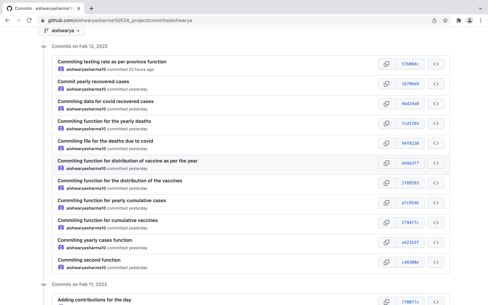
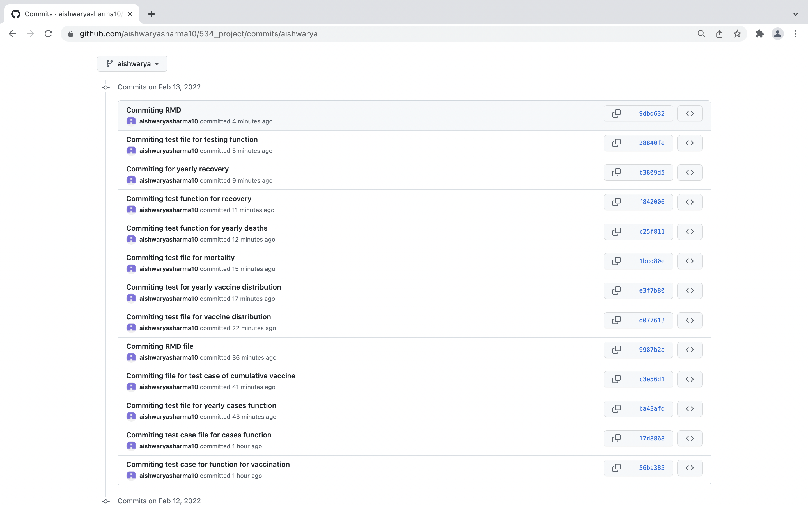

# 534_project Contributions of Aishwarya

## Day 1 Aishwarya:

I along with the other group members discussed the overall structure of the project. 
- We discussed what approach to follow and how to collaborate the whole work.
- We made decissions on which group member will do which work.
- I worked on the vaccination doses data in Canada. I understood the whole data and created different functions out of that.
- My first function was on creating the request with the API and I stored the data in a JSON format.
- My another function was regarding the covid vaccines for that data. I did certain data cleaning in that function along with the data wrangling. The function is called 'vaccine_as_per_province()'. 
- This would take the argument as string/ character which would be the name of the province in Canada and will return the corresponding data frame displaying the data regarding the vaccinations done in that province.
- If user does not passes any argument then by default, Canada is taken and the whole data set for the full country is returned.
- I also decided to use dplyr library instaed of normal R functions as it privides great options to work with data and to use it in the desired format.
- Following is the link to the git repository along with the screenshot of the commits done by me.

https://github.com/aishwaryasharma10/534_project.git

## Day 2 Aishwarya:

On day two, I have written various functions using the API 'https://api.opencovid.ca/timeseries'
Following is the list of the functions that I have created:

- vaccine_as_per_province
- cases_as_per_province
- Yearlycases_as_per_province
- cumulativevaccine_as_per_province
- vaccine_distribution
- yearly_vaccine_distribution
- mortality
- yearly_deaths
- recovered
- yearly_recovered
- testing

- Following is the link to the git repository along with the screenshot of the commits done by me.

https://github.com/aishwaryasharma10/534_project.git

## Day 3 Aishwarya:

On third day, I have written various tests for the functions using the API 'https://api.opencovid.ca/timeseries'
Following is the list of the functions for which I have created the test cases.

- vaccine_as_per_province
- cases_as_per_province
- Yearlycases_as_per_province
- cumulativevaccine_as_per_province
- vaccine_distribution
- yearly_vaccine_distribution
- mortality
- yearly_deaths
- recovered
- yearly_recovered
- testing

- Following is the link to the git repository along with the screenshot of the commits done by me.

https://github.com/aishwaryasharma10/534_project.git

## Day 4 Aishwarya:

- Fourth day was the day for merging major of the project. We have merged our code from different individual branches and  have created the package out of that.
- All the required documentation was completed on fourth day and we have created the final project and have pushed that on the GitHub.
- I have studied how to create the vignette along with certain documentation on how to publish our package over the CRAN.
- I have passed on the research I did on that and we have planned to implement that vignette finalization on the next day.

- Following is the link to the git repository along with the screenshot of the commits done by me.

https://github.com/aishwaryasharma10/534_project.git
